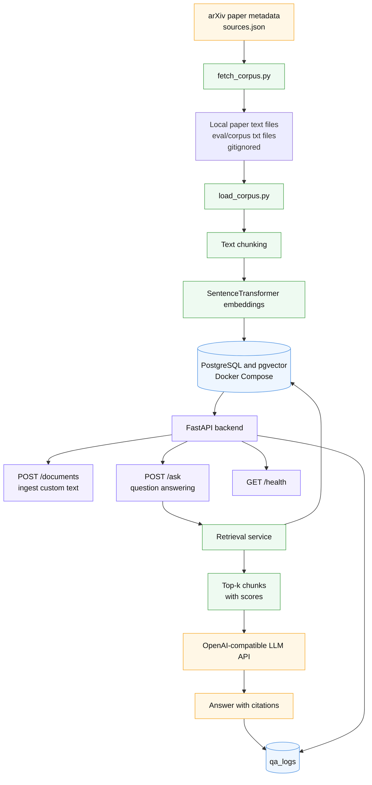
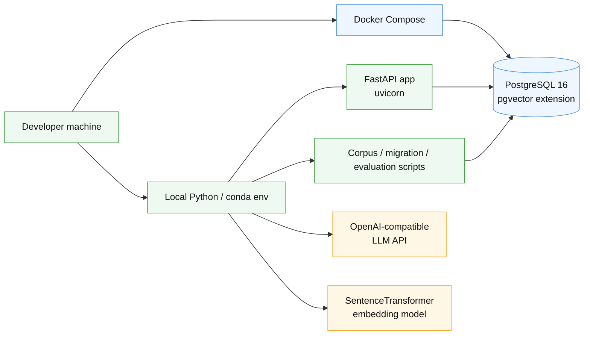
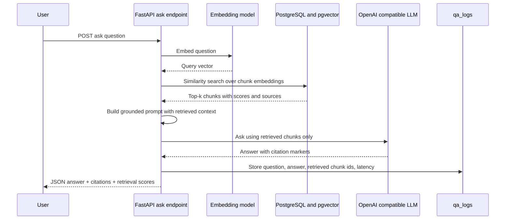
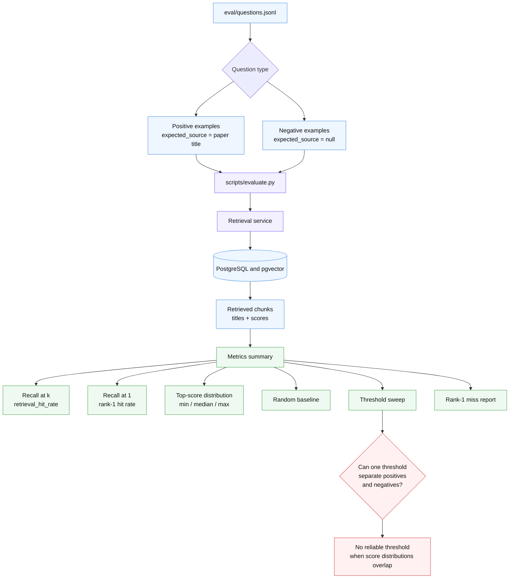

# AI Paper QA Backend

A retrieval-augmented question answering service over a corpus of machine learning
papers. You import documents, the service splits and embeds them, and then it answers
questions using only the passages it retrieved — returning those passages alongside the
answer so you can check it.

Built as a learning project: small enough to read end to end, but layered the way a
production service is.

## What This Project Does

Four endpoints:

| Method | Path | What it does |
|---|---|---|
| `GET` | `/health` | Is the process up. Deliberately does not touch the database |
| `POST` | `/documents` | Import a document; it is chunked and embedded on the way in |
| `GET` | `/documents` | List what has been imported |
| `POST` | `/ask` | Answer a question from the stored documents, with sources |

An answer comes back with the chunks it was built from, and each `[n]` marker in the
answer text refers to one of them:

```json
{
  "answer": "Self-attention helps models connect tokens across a sequence [1].",
  "sources": [
    {
      "document_id": "2f766daa-e988-475a-a5a5-1d216aee5459",
      "title": "Demo Paper",
      "chunk_index": 0,
      "text": "Self-attention helps models connect tokens across a sequence. ...",
      "score": 0.5302434527583813
    }
  ]
}
```

`score` is cosine similarity: higher means closer to the question. It is the only signal
you have for judging whether the sources are actually about what you asked — the answer
text reads the same either way.

## What You Will Learn

- **Layering a FastAPI service.** Routes parse and translate; services own business rules
  and transaction boundaries; repositories issue SQL; `app/rag/` holds the retrieval and
  model code and never touches the database.
- **Vector search with pgvector** at a scale where an index is not yet worth building, and
  what changes when it is.
- **Embeddings** with `sentence-transformers`, including why the model choice is a schema
  decision rather than a config setting.
- **Prompting an LLM to answer only from retrieved context**, and why "the sources do not
  contain enough information" is a normal answer rather than an error.
- **Testing without the heavy dependencies** — fakes for the embedding model and the LLM,
  a real database, and a transaction per test.
- **Evaluating retrieval**, which turns out to be the hard part: a hit rate is meaningless
  unless you know what a random ranking would have scored on the same corpus.

## System Architecture



```
HTTP        app/api/          parse the request, call one service, translate the result
                              or the exception into a status code. No SQL, no decisions.
Business    app/services/     one method = one complete action. Owns validation and the
                              transaction boundaries (session.commit lives here).
Data        app/repositories/ SQL only. No validation, no commits.
Model       app/models/       the three tables.
RAG         app/rag/          chunking, embeddings, the LLM client. No database.
Core        app/core/         settings, engine, session factory.
```

`POST /documents` runs in two transactions, on purpose:

1. `DocumentIngestionService.ingest` hashes the content, returns early if that hash is
   already stored, otherwise writes the document and its chunks — then commits.
2. `IndexingService.index_document` encodes those chunks and writes the vectors — then
   commits separately.

Because they are separate, a failure while embedding still leaves the document stored: the
request returns 500, but nothing is lost, and resubmitting the same content takes the
"already imported" path and runs indexing again. The endpoint is self-healing.

`POST /ask` reads and never writes the corpus. Its one write is an audit row holding the
question, the answer, the chunks the model was shown and the elapsed time; a failure to
write that row is logged and absorbed, so an unwritable log cannot cost you an answer that
has already been produced.

## Local Setup

You need **PostgreSQL 16 with the pgvector extension**, and **Python 3.11+**.

PostgreSQL comes from Docker Compose — `docker compose up -d postgres` starts the database
and nothing else, because the API runs on the host as a plain Python process.
`scripts/db.py`, a small wrapper around the `pg_ctl` and `psql` binaries, is still there as
a **local-only fallback** for machines without Docker; the two paths are alternatives, not
steps of one setup.



```bash
git clone https://github.com/zaughterCoding/AI-Paper-QA.git
cd AI-Paper-QA
```

**1. Create the environment.** `postgresql=16` is not arbitrary: the conda-forge build of
pgvector for Windows is pinned to libpq 16, and asking for a newer PostgreSQL fails to
solve.

```bash
conda create -n paperqa python=3.11 postgresql=16 pgvector -c conda-forge
conda activate paperqa
```

Only Python is used by the Docker path — `postgresql` and `pgvector` are there for the
fallback. Installing all three anyway is deliberate: one environment then covers both
paths, and that is the combination this README was verified against.

**2. Install torch as a CPU-only build, before anything else.** `sentence-transformers`
depends on torch, and a plain install on Windows resolves the CUDA build — about 2.5 GB for
a project that never uses a GPU.

```bash
pip install --index-url https://download.pytorch.org/whl/cpu torch
pip install -e ".[dev]"
```

**3. Configure.** Copy the example file and edit it. `.env` is gitignored; never commit it.

```bash
cp .env.example .env
```

The one value you must set is `LLM_API_KEY`. The default provider is DeepSeek, and any
OpenAI-compatible endpoint works — change `LLM_BASE_URL` and `LLM_MODEL` together with it.

**4. Keep the model cache off your system drive (optional).** The embedding model is about
88 MB and downloads to `~/.cache/huggingface` by default:

```bash
export HF_HOME=/path/to/hf-cache        # PowerShell: $env:HF_HOME='D:\hf-cache'
```

Note this is a shell variable, not a `.env` entry — see Common Errors.

## Start the Database

### Recommended: Docker Compose

`docker-compose.yml` starts **PostgreSQL 16 with pgvector**. It starts the database only —
the API is not containerised (see [Why the API is not in a container](#why-the-api-is-not-in-a-container)).
The credentials match `DATABASE_URL` in `.env.example`, so there is nothing to configure.

```bash
docker compose up -d postgres
```

`up -d` returns as soon as the container is created, which is well before PostgreSQL
accepts connections. The compose file defines a health check, so wait for it rather than
guessing:

```bash
docker compose ps        # STATUS reads "healthy" when it is ready
```

The rest of the lifecycle:

```bash
docker compose logs -f postgres                          # watch it
docker compose exec postgres psql -U postgres -d paperqa # a psql shell
docker compose down                                      # stop it; your data survives
docker compose down -v                                   # stop it and delete the data
```

Data lives in a **named volume** (`paperqa-pgdata`), not a host directory, so nothing in
this repository points at a path on your machine and `git clean` cannot reach your
database. `down` removes the container and keeps the volume; only `down -v` discards it.

### Then create the tables

```bash
python -m alembic upgrade head
```

`python -m alembic` rather than a bare `alembic`, so the command does not depend on the
environment's `Scripts` directory being on your `PATH`. The database URL comes from `.env`,
not from `alembic.ini`, so there is one place to change it. The migration also runs
`CREATE EXTENSION IF NOT EXISTS vector`, so pgvector needs no separate step.

### Fallback: a local PostgreSQL (`scripts/db.py`)

If Docker is not available, the same database can be run directly from the conda
environment created above. `scripts/db.py` wraps PostgreSQL's own binaries, and locates
them from the interpreter you run it with — so it has to be *that* interpreter.

```bash
python scripts/db.py init        # create the data directory (once)
python scripts/db.py start       # start the server on port 5432
python scripts/db.py create-db   # create the paperqa database (once)
python scripts/db.py status      # is it running
python scripts/db.py psql        # open a psql shell
```

The data directory has a built-in default that is specific to the machine this was
developed on, so set `PAPERQA_PGDATA` to a path of your own. It is kept outside the repo
so that a `git clean` cannot delete your database:

```bash
export PAPERQA_PGDATA=/path/to/pgdata     # PowerShell: $env:PAPERQA_PGDATA='D:\pgdata'
python scripts/db.py init
```

This path is **local-only**: it is not covered by the compose file, and it is the reason
those two conda packages are installed. It also binds the same port, so the two paths
cannot run at the same time — stop one before starting the other
(`docker compose down`, or `python scripts/db.py stop`).

### Why the API is not in a container

There is deliberately no `Dockerfile`. The API is a plain Python process: `uvicorn
app.main:app` with a real terminal gives you the traceback and the debugger, and code
changes need no rebuild. Packaging it would add a build step, an image to keep in sync
with `pyproject.toml`, and a file-mount layer between you and the source — for a service
whose entire runtime dependency is PostgreSQL.

## Run the API

```bash
uvicorn app.main:app --port 8000
```

```bash
curl http://127.0.0.1:8000/health
# {"status":"ok"}
```

`/health` reports whether the process is up, not whether it can reach the database — it
answers `200` even with PostgreSQL stopped. That is intentional: a liveness probe that
fails because a dependency is down gets your process restarted for no reason.

## Import a Document

One document, straight through the API:

```bash
curl -X POST http://127.0.0.1:8000/documents \
  -H "Content-Type: application/json" \
  -d '{"title":"Demo Paper","source":"manual","content":"Self-attention helps models connect tokens across a sequence. Transformers use attention instead of recurrent networks."}'
```

```json
{"document_id":"2f766daa-...","chunk_count":1,"created":true,"embedded_chunk_count":1}
```

`created` is false when the same content was already imported, and `embedded_chunk_count`
says how many vectors this request actually wrote — with only `chunk_count` you could not
tell success from "stored but never embedded".

### Or load the evaluation corpus

**The paper texts are not distributed with this repository.** They are downloaded on your
machine instead. What *is* committed is the manifest — `eval/corpus/sources.json`, holding
each paper's title, arXiv URL and licence — and the evaluation set `eval/questions.jsonl`
that refers to it. `sources.json` is also the corpus's only attribution record: the
extractor strips copyright notices by design, so the individual `.txt` files carry no
attribution of their own.

`eval/corpus/*.txt` is listed in `.gitignore`, so the papers cannot be committed by
accident. **Downloading them locally is the intended workflow — do not add them back to
git.** Fetch them from the manifest:

```bash
python scripts/fetch_corpus.py          # add --force to re-download existing files
```

This is the only step that needs network access. Running it twice is safe: files already
on disk are skipped, so a second run reports every paper as `skipped`.

Then load it through the API, which exercises the real path — routing, dependency
injection and the real embedding model — rather than calling the service directly:

```bash
# in one terminal
uvicorn app.main:app --port 8000
# in another
python scripts/load_corpus.py
```

It is idempotent: re-running it re-imports nothing, because `POST /documents` dedupes on a
content hash. If a run was interrupted and left chunks without vectors, fill them in with:

```bash
python scripts/index_pending.py
```

## Ask a Question



```bash
curl -X POST http://127.0.0.1:8000/ask \
  -H "Content-Type: application/json" \
  -d '{"question":"What does self-attention help with?","top_k":3}'
```

`top_k` defaults to 5 and is capped at 20. It is a context budget rather than a result
count: every extra chunk is more prompt, so raising it costs tokens on every question.

A question the corpus cannot answer is a normal outcome, not an error — you get `200` and
the answer `"The sources do not contain enough information to answer this question."`,
without the model being called at all.

## Run Tests

The database must be running; the tests create and use a separate `paperqa_test` database
and roll back after each test, so they never touch your data.

```bash
pytest
```

Some tests load the real embedding model and are skipped by default, because they download
weights and take a few seconds each:

```bash
PAPERQA_RUN_MODEL_TESTS=1 pytest
```

If the corpus is missing, the tests that check `eval/questions.jsonl` against it fail —
that is the intended behaviour, and `python scripts/fetch_corpus.py` is the fix.

## Run Evaluation

`scripts/evaluate.py` runs every question in `eval/questions.jsonl` through retrieval and
prints one JSON object to stdout. Progress goes to stderr, so the output stays pipeable.



```bash
python scripts/fetch_corpus.py      # if you have not already
python scripts/load_corpus.py       # needs the API running
python scripts/evaluate.py
```

```json
{
  "question_count": 35,
  "positive_count": 25,
  "negative_count": 10,
  "retrieval_hit_rate": 0.88,
  "retrieval_rank1_hit_rate": 0.64,
  "avg_top_score": 0.5754,
  "top_score_positives": {"count": 25, "min": 0.4029, "median": 0.5926, "max": 0.6852},
  "top_score_negatives": {"count": 10, "min": 0.3837, "median": 0.4126, "max": 0.5246},
  "false_positive_rate_no_threshold": 1.0,
  "threshold_separates": false,
  "separating_gap": -0.12176718003149445
}
```

The set has two kinds of question. A **positive** names the document that should be
retrieved; a **negative** sets `"expected_source": null` and claims the corpus cannot
answer it, with `expected_terms` listing words that must appear nowhere in the corpus if
that claim is true. Ten negatives against twenty papers is what makes a false-positive rate
measurable at all.

**Read the hit rate against its baseline, not on its own.** With 20 documents and
`top_k=5`, a ranking drawn at random finds the labelled document about **0.19** of the
time. That number is a property of the corpus, not of any particular run — so with the
corpus at five documents it was 0.68, and the hit rate read `1.000` while saying almost
nothing. If you change the corpus, recompute the baseline before reading the score.

The two hit rates differ on purpose. `retrieval_hit_rate` asks whether the right document
appears anywhere in the returned chunks; `retrieval_rank1_hit_rate` asks whether it is
ranked first. On this corpus the loose one reads 0.88 while nine questions still have the
wrong document at rank 1 — `rank1_misses` names them.

`threshold_separates: false` is the honest answer to "what similarity score should we cut
at": on this corpus the positive and negative score distributions overlap
(`separating_gap` is negative), and no threshold keeps most positives while rejecting most
negatives. `false_positive_rate_no_threshold: 1.0` records the current behaviour — with no
threshold, a question the corpus cannot answer still gets five chunks. The sweep in
`threshold_sweep` is evidence about scores, not a recommendation; nothing in the service
reads it.

## Project Structure

```
app/
  api/            routes.py, schemas.py — HTTP in and out
  core/           config.py (Settings), database.py (engine, session)
  models/         tables.py — Document, Chunk, QaLog
  rag/            chunking.py, embeddings.py, llm.py — no database access
  repositories/   SQL per table
  services/       ingestion, indexing, retrieval, answering
alembic/          migrations
docker-compose.yml PostgreSQL 16 + pgvector, database only
eval/
  questions.jsonl the evaluation set (committed)
  corpus/         sources.json (committed) + the papers (downloaded, gitignored)
scripts/
  db.py           local PostgreSQL lifecycle — fallback when Docker is unavailable
  fetch_corpus.py download the corpus from arXiv
  load_corpus.py  import it through the HTTP API
  index_pending.py backfill missing embeddings
  evaluate.py     run the evaluation set through retrieval
tests/
```

## Common Errors

| What you see | What it means | Fix |
|---|---|---|
| `docker compose up` fails with `cannot connect to the Docker daemon` | Docker Desktop is installed but not running | Start Docker Desktop and wait for it to report it is running |
| `docker compose up -d postgres` fails with `Ports are not available: ... 0.0.0.0:5432` | Something already holds port 5432 — usually the `scripts/db.py` fallback, which binds the same port | `python scripts/db.py stop`, or point one of them at another port |
| `alembic upgrade head` fails with a connection error right after `docker compose up -d` | `up -d` returns before PostgreSQL is accepting connections | `docker compose ps` until STATUS reads `healthy`, then retry |
| `docker compose down -v` | Not an error — a warning: **`-v` deletes the volume and your whole database.** Plain `docker compose down` keeps it | Use `down` unless you mean to start over |
| `POST /documents` returns `500 Internal Server Error`, body is plain text | The database is not reachable. The real error (`sqlalchemy.exc.OperationalError`) is only in the server log, never in the response | `docker compose ps` if you use Docker, otherwise `python scripts/db.py status` |
| `/health` returns `{"status":"ok"}` but everything else fails | Expected — `/health` never touches the database | Check the database with `db.py status` |
| `{"detail":"llm_api_key must be set (see .env.example)"}`, HTTP 422 | `LLM_API_KEY` is empty or missing from `.env` | Set it in `.env`, then restart the API |
| HTTP 502, `the model endpoint failed: Client error '401 Unauthorized'` | The key is set but rejected by the provider. The key itself is never included in the message | Check the key, and that `LLM_BASE_URL` matches the provider |
| `pg_ctl.exe not found (...)` from `scripts/db.py` (fallback path only) | You ran it with the wrong Python. PostgreSQL's binaries are located from `sys.executable` | Use the environment's interpreter: `python scripts/db.py ...` after `conda activate paperqa` |
| `Data directory not initialized` (fallback path only) | `db.py init` has not run for that `PAPERQA_PGDATA` | `python scripts/db.py init` |
| The model downloads again on every run, or lands on `C:` | `HF_HOME` set inside `.env` has no effect — settings are declared `extra="ignore"`, so it is dropped before HuggingFace ever reads the process environment | Export it in your shell instead: `export HF_HOME=...` |
| `Configuration file contains invalid cp936 characters`, or alembic crashes reading `alembic.ini` | On a Chinese-locale Windows machine those config files are read with the system codec | Keep `.condarc`, `pip.ini` and `alembic.ini` ASCII-only. Python source files are unaffected |
| Tests error with `PermissionError` on a `pytest-of-...` temporary directory | A shared machine-level temp directory pytest cannot scan makes every `tmp_path` test fail before it starts | Handled in `tests/conftest.py`, which moves the temp root inside the project. If you see it, that file did not run |

## Next Iterations

- **A rebuild path when the embedding model changes.** Re-encoding writes vectors only for
  chunks that lack one, so switching models would leave two kinds of vector in one index.
  That degrades retrieval quietly rather than failing, which makes it the most important
  thing on this list.
- **Retrieval quality.** Nine of twenty-five questions put the wrong document at rank 1.
  Adjacent-chunk expansion after retrieval is the cheapest idea not yet tried: chunks
  overlap, so a chunk's neighbours often carry the sentence it is missing.
- **`top_k` and `chunk_size` have never been derived from anything.** The evaluation set
  cannot currently tell `top_k=5` from `top_k=20` — rank 1 does not move — so the choice
  stays a budget decision until a question exists whose answer sits in the middle ranks.
- **A similarity threshold**, which needs either a better embedding model or a corpus whose
  answerable and unanswerable questions score further apart than they do now.
- **A vector index.** Not built: below roughly 100k chunks a sequential scan is fast enough
  and an index costs recall. Worth revisiting on measurement, not on principle.
- **Pagination on `GET /documents`.** Ordering is by `created_at` alone, so documents
  created in the same instant can be skipped or repeated across pages.
- **Operational gaps.** Audit-log write failures are logged and otherwise silent — they
  should be counted and alerted on. `qa_logs` is written but has no read endpoint.
